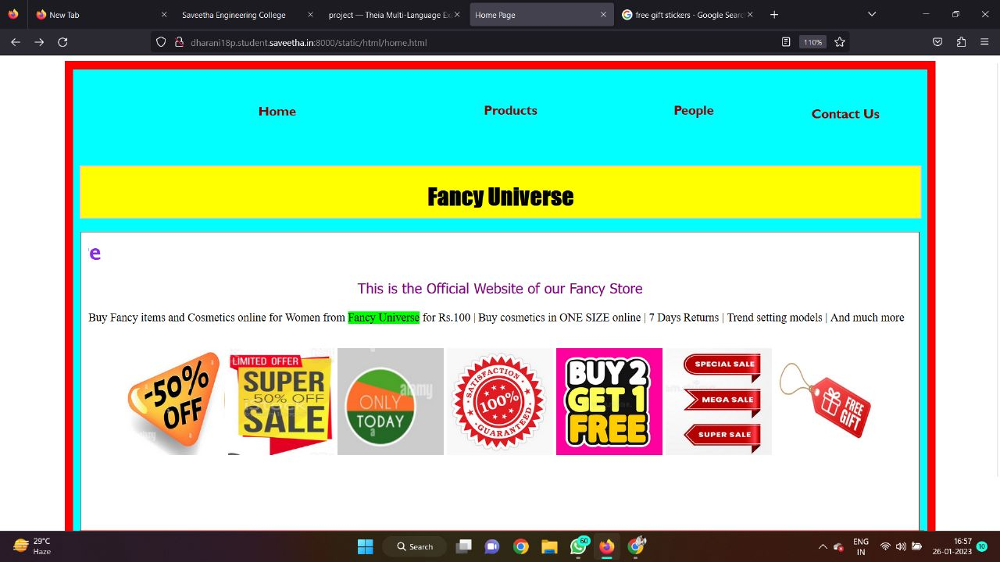
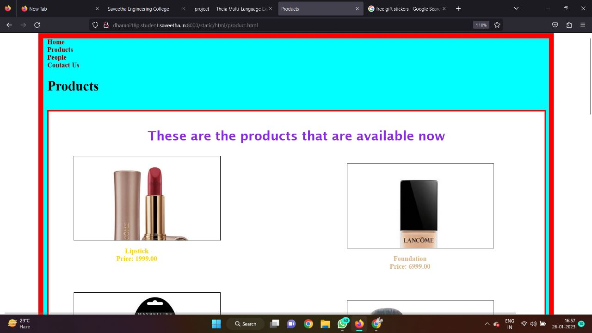
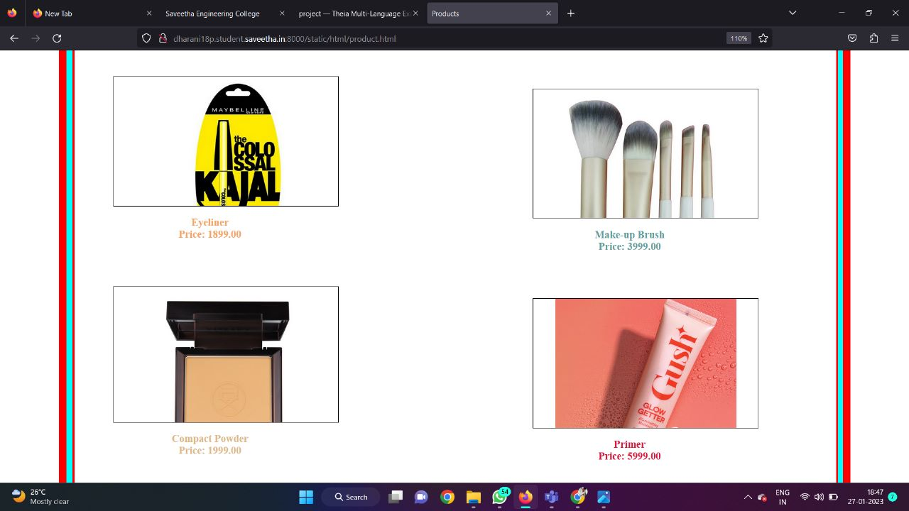
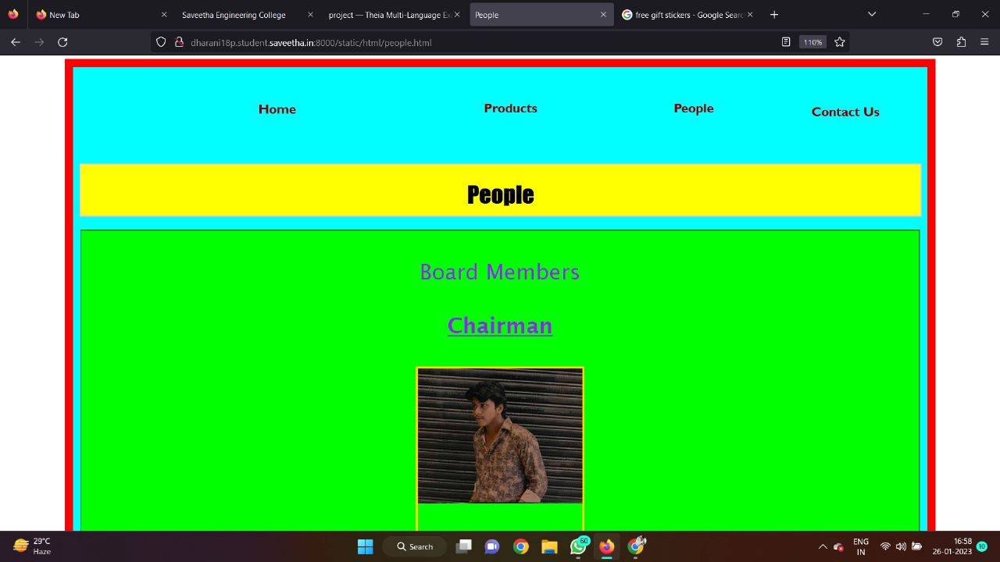
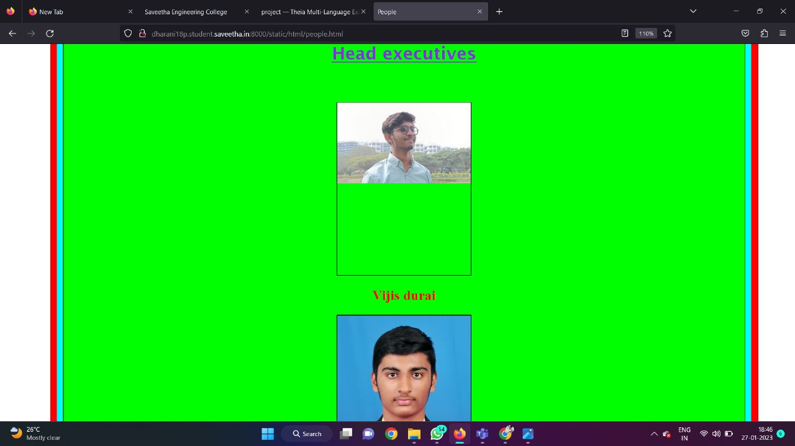
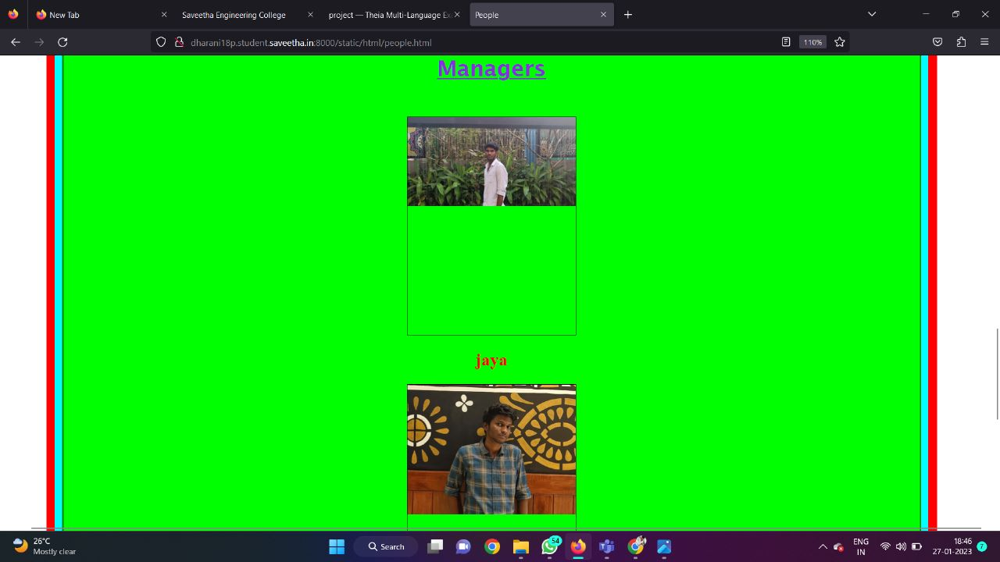
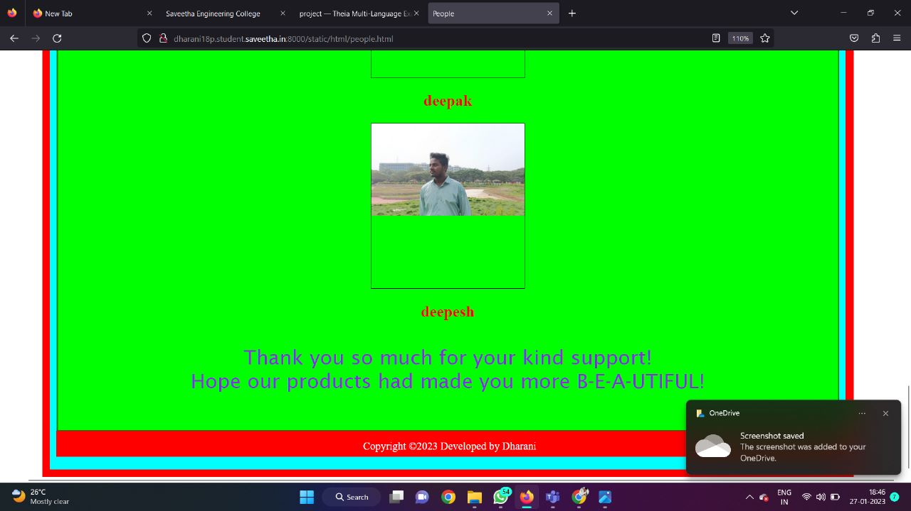
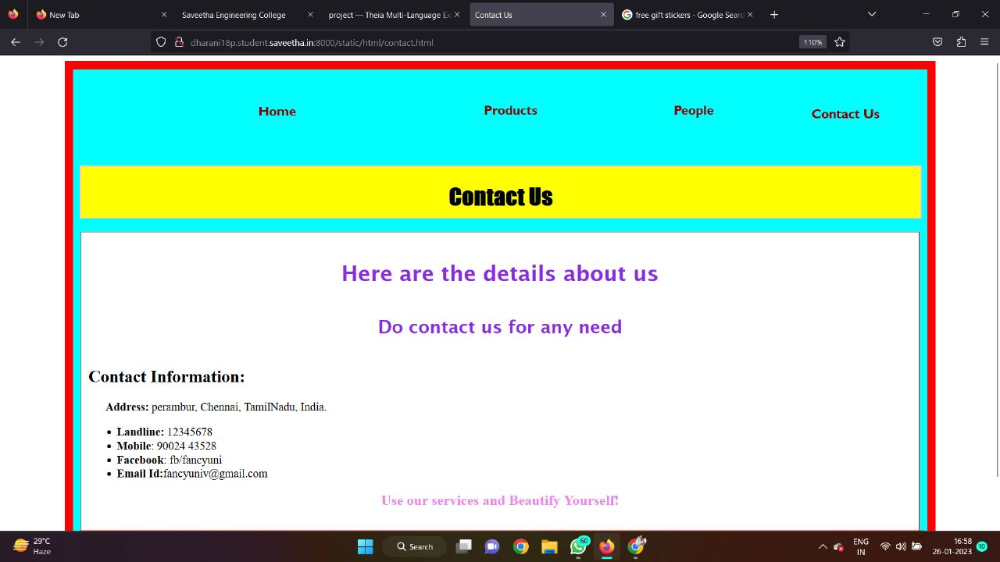
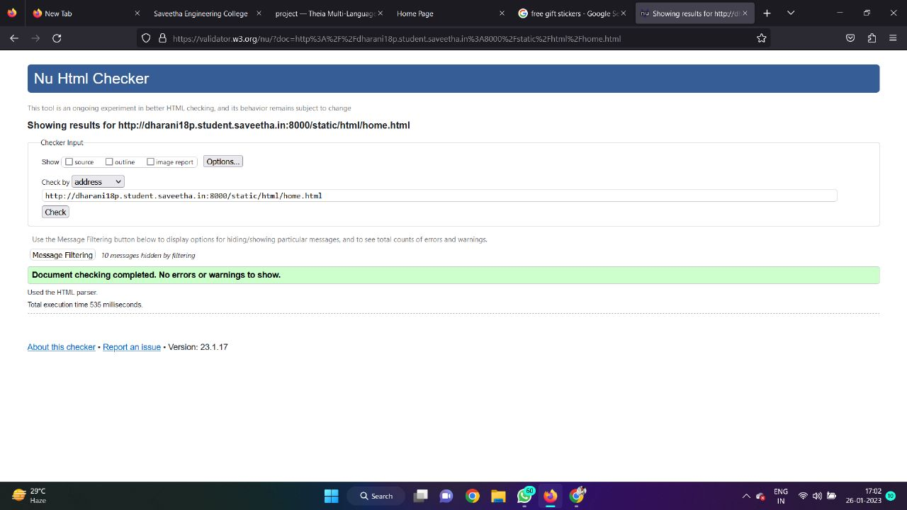

# Web Design for a Software Product Company

## DESCRIPTION:

The Product Company Website is a professional platform designed to showcase the products and services of a software company. It features a responsive and user-friendly layout, built using HTML and CSS, to provide an engaging experience for visitors. The site includes sections for product highlights, company information, and contact details, ensuring seamless navigation. Its clean design emphasizes clarity and accessibility, making it an effective tool for promoting the company’s offerings. Ideal for establishing a strong online presence, this website captures the essence of modern web design principles.

## OUTPUT:

### Home Page:

### Products

### Peoples

### contact us 

### validator page

